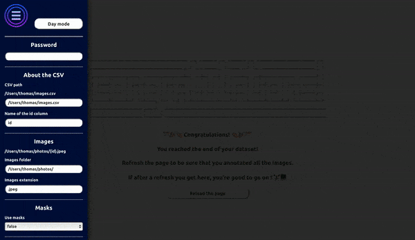

# Fast Dataset Cleaner by PhotoRoom - 🏃



## Installation

- Run `pip3 install fast-dataset-cleaner`.

## Launch the platform

Run `fast-dataset-cleaner` in your CLI. You can optionally add a specific port: `fast-dataset-cleaner --port _CUSTOM_PORT_` (default: 1747).
Open your browser and go to _localhost:1747_ (or your custom port) to see the live platform.

## Requirements

- Save images for annotation in a single folder.
- Create a csv with an _id_ column containing all the ids or names of the images to annotate. For instance, if your images are in *image_{id}.jpg* format, your csv should look like :
```
id
image_0
image_1
image_2
```

## How it works

This platform is designed for binary classification of images. This can be helpful either to clean up datasets or to add a label to each image.

When launching the platform for the first time, you have to fill in the entries in the left menu - accessible by clicking on the banner or by typing on the _Space bar_. Once you are finished, click on the _Get images_ button or reload the page. The required password is the one displayed in your CLI.

The entire annotation process can be done using the keyboard. The images are displayed with a number on their left. To annotate one of them, press the associated key or click on the card. By default, each image has the value _true_. When all the images on a page are annotated, press the *_Enter_* key to validate the annotations. You can then check in your files that a new csv was created - the initial name of the csv with the suffix *_annotated* - with two new columns for the annotator and the annotation, and that these annotations have been saved.

You can *change pages with the arrows on your keyboard*, which allows you to navigate through your dataset and re-annotate some images if necessary. BEWARE: ONLY the _Enter_ button saves the annotations.

When refreshing the page, unlabeled images are displayed. If after a page refresh the final screen is displayed, you're done labeling your dataset! 🎉

## Use masks

You can also use masks to check segmentations. For this task, save all your binary masks in another folder with the same ids as the original images. Add this folder to the platform entries and you should be able to see the segmented images after a page refresh.

## Shortcuts

For convenience and speed, we implemented a few keyboard shortcuts:

- Open/Close the menu: _m_ or _Space bar_.
- Navigate between images: Keyboard arrows.
- Annotate an image: Press the number key associated with the image number.
- Validate annotations: _Enter_.
- Load images when the menu is open: _i_ or _g_.
